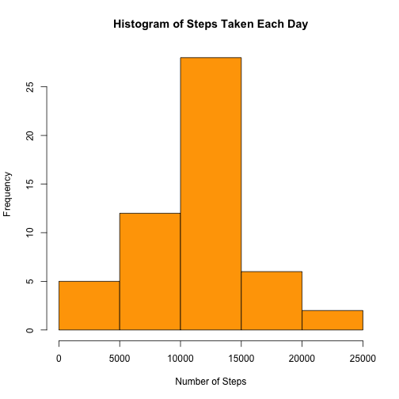
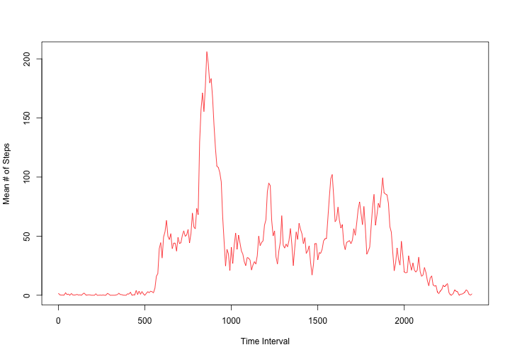
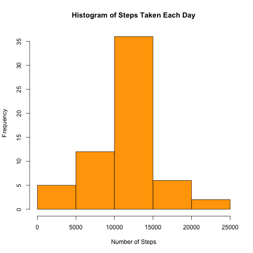
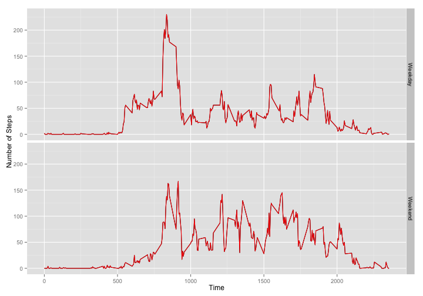

#### Section 1 - Load and Preprocess Data

Read the data file and show summary of dataset using below code


```r
Activity_Data <- read.csv("activity.csv")
summary(Activity_Data)
```

```
##      steps                date          interval     
##  Min.   :  0.00   2012-10-01:  288   Min.   :   0.0  
##  1st Qu.:  0.00   2012-10-02:  288   1st Qu.: 588.8  
##  Median :  0.00   2012-10-03:  288   Median :1177.5  
##  Mean   : 37.38   2012-10-04:  288   Mean   :1177.5  
##  3rd Qu.: 12.00   2012-10-05:  288   3rd Qu.:1766.2  
##  Max.   :806.00   2012-10-06:  288   Max.   :2355.0  
##  NA's   :2304     (Other)   :15840
```

Subset the dataset by omitting NA's (using sqldf package)


```r
require("sqldf")
require ("plyr")
require("lubridate")
require("date")
require("ggplot2")
Processed_Data <- sqldf("select sum(steps) as steps, 
                                date
                                from Activity_Data 
                                group by date 
                                having steps <> 'NA'")
```

#### Section 2 - What is mean total number of steps taken per day?

Here is a historgam of steps taken each day

 

Mean number of steps taken per day is 1.0766189 &times; 10<sup>4</sup>

Median number of steps taken per day is 10765


####Section 3 - What is the average daily activity pattern?

Below graph is plotted using ts() function for plotting time series

 

Time interval 835 has the highest average number of steps.


#### Section 4 - Imputing missing values

Number of rows with missing step counts - 2304

Use plyr packages match funtion to update missing data


```r
Missing_Data <- Activity_Data[is.na(Activity_Data$steps),]
Missing_Data$steps <- round(Average_Step$AverageSteps[match(Average_Step$interval, Missing_Data$interval)])
Complete_Data <- rbind(Missing_Data, Activity_Data[!is.na(Activity_Data$steps),])

Summarized_Step_Data <- sqldf("select sum(steps) as steps, 
                                      date
                                      from Complete_Data 
                                      group by date")
```

Here is a historgam after replacing missing values with interval average. It does not look much different

 

Mean number of steps taken per day is 1.0765639 &times; 10<sup>4</sup>

Median number of steps taken per day is 1.0762 &times; 10<sup>4</sup>


##### Difference between overvations before and after updated missing values
* The shape of the histogram is same, however, as expected the frequency has increased due to inclusion of ~3000 missing values. Since mean step count of each interval was introduced for each missing value, the distribution has not visibly changed

* The mean value has changed negligibly

* The Median value has shifted to next lower value, apparently because of introduction of average steps


#### Section 5 - Are there differences in activity patterns between weekdays and weekends?


```r
Days <- c("Mon", "Tue", "Wed", "Thu", "Fri", "Sat", "Sun")
Day_Ind <- c(rep("Weekday",5),rep("Weekend",2))

Weekday_Ind <- data.frame(Days,Day_Ind)

Complete_Data$day <- weekdays(as.Date(Complete_Data$date, format="%Y-%m-%d"),abbreviate=TRUE)

Complete_Data$dayofweek <- Weekday_Ind$Day_Ind[match(Complete_Data$day,Weekday_Ind$Days)]

Average_Steps_Day <- sqldf("select round(sum(steps)/count(steps)) as step, 
                                   interval, 
                                   dayofweek 
                                   from Complete_Data 
                                   group by dayofweek, interval")


Average_Steps_Day$dayofweek <- as.factor(Average_Steps_Day$dayofweek)
```

As shown in the plot below, the pattern of number of steps is similar between weekends and weekday with minor deviations (e.g step activity picks up in the mid intervals during weekends as compared against same during weekdays)

 
